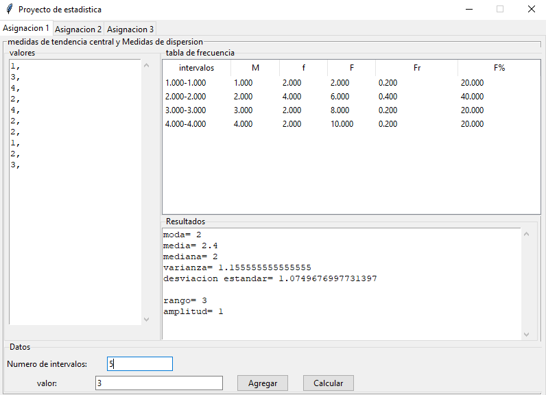
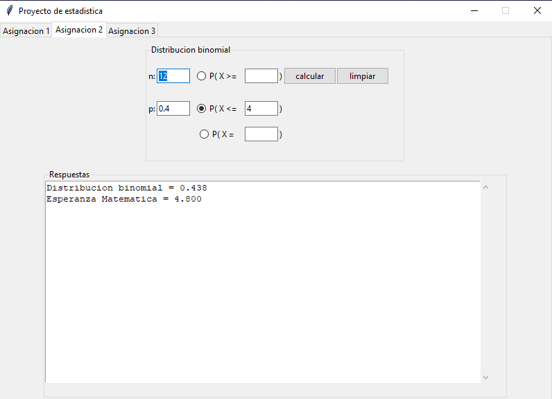
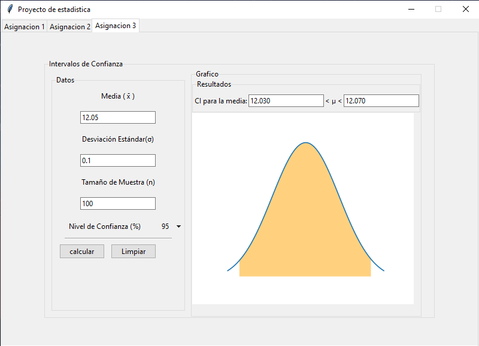

# Statistics project

this is my project for the Statistics Class, this app calculates:

<ul>
    <li>Measures of central tendency and measures of dispersion</li>
    <li>Binomial distribution</li>
    <li>Confidence intervals</li>
</ul>

## Usage

Download the source code and run in cmd

```cmd
python3 main.py
```

## How to generate exe with embedded interpreter

Before generating the exe, first install the PyInstaller library with the following command:

```cmd
pip install pyinstaller
```

then run the following command to generate the executable

```cmd
pyinstaller -w main.py --noconsole -F --icon=name_of_the_icon_file.ico --name=AppName
```

Note: the icon parameter is optional

## Screenshots
<br>

### Measures of central tendency and measures of dispersion

<br>
<br>

### Binomial distribution

<br>
<br>

### Confidence intervals

<br>
<br>

## License
[MIT](https://choosealicense.com/licenses/mit/)